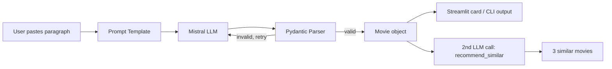

# 🎬 CineSage AI

**Turn a plain-English movie description into structured data — then get AI-powered recommendations for similar films.**


> Paste a paragraph like *"Inception is a 2010 sci-fi thriller directed by Christopher Nolan..."*
> and CineSage AI returns clean, validated JSON — title, year, genre, director, cast, rating,
> summary — then chains a second AI call to suggest movies you'd enjoy next.

---

## ✨ Features

- **Structured extraction** — unstructured text → validated `Movie` object (Pydantic schema, not a raw LLM guess)
- **AI recommendations** — a second, chained LLM call suggests 3 similar movies based on the extracted data
- **Streamlit UI** — card-based layout, session history, one-click CSV/JSON export
- **CLI mode** — batch-process a whole file of movie descriptions from the terminal
- **Validated output** — rating and release year are range-checked; malformed AI output is retried automatically
- **Tested** — core logic is unit-tested with a mocked LLM, so tests run offline with no API key

---

## 🖼️ Demo

*(Add a screenshot or short GIF of the Streamlit app here once you run it locally — drag the image into this README on GitHub and it will embed automatically.)*

---

## 🏗️ How it works



The extraction and recommendation steps are two independent, chained LLM calls —
the output of the first (a validated `Movie`) becomes the input to the second.

---

## 🛠️ Tech Stack

| Layer | Choice |
|---|---|
| LLM | Mistral (`mistral-small`) via `langchain-mistralai` |
| Orchestration | LangChain (prompt templates, output parsers) |
| Validation | Pydantic v2 |
| UI | Streamlit |
| Testing | pytest + unittest.mock |

---

## 📁 Project Structure

```
cinesage-ai/
├── cinesage/
│   ├── __init__.py
│   ├── schema.py         # Movie & Recommendations pydantic models
│   ├── extractor.py       # paragraph -> Movie (with retry logic)
│   ├── recommender.py    # Movie -> similar movie suggestions
│   └── storage.py        # history persistence + CSV export
├── tests/
│   ├── test_schema.py
│   └── test_extractor.py
├── app.py                # Streamlit UI
├── cli.py                # command-line interface
├── requirements.txt
├── .env.example
└── README.md
```

---

## 🚀 Getting Started

### 1. Clone and install

```bash
git clone https://github.com/YOUR_USERNAME/cinesage-ai.git
cd cinesage-ai
python -m venv venv
source venv/bin/activate      # Windows: venv\Scripts\activate
pip install -r requirements.txt
```

### 2. Add your API key

```bash
cp .env.example .env
```

Then open `.env` and paste your free key from [console.mistral.ai](https://console.mistral.ai/).

### 3. Run the app

```bash
streamlit run app.py
```

### 4. Or use the CLI

```bash
# Single movie
python cli.py --text "Inception is a 2010 sci-fi thriller directed by Christopher Nolan..."

# Batch file (one movie paragraph per line) + recommendations + save to JSON
python cli.py --file movies.txt --recommend --out results.json
```

---

## ✅ Running Tests

```bash
pytest -v
```

Tests mock the LLM entirely, so they run instantly with no API key required —
useful for CI pipelines.

---

## 🗺️ Roadmap

- [ ] Fetch real posters via a movie metadata API
- [ ] Support batch upload of a CSV of paragraphs in the Streamlit UI
- [ ] Add a Dockerfile for one-command setup
- [ ] Swap in any LangChain-supported model (OpenAI, Groq, Gemini) via a config flag

---

## 🙏 Acknowledgements

Built while following [Akarsh Vyas's Generative AI course](https://github.com/AkarshVyas/GenAI-Youtube-1)
on LangChain fundamentals, then extended with recommendation chaining, validation,
history/export, a CLI, and test coverage.

---

## 📄 License

MIT — see [LICENSE](LICENSE).
